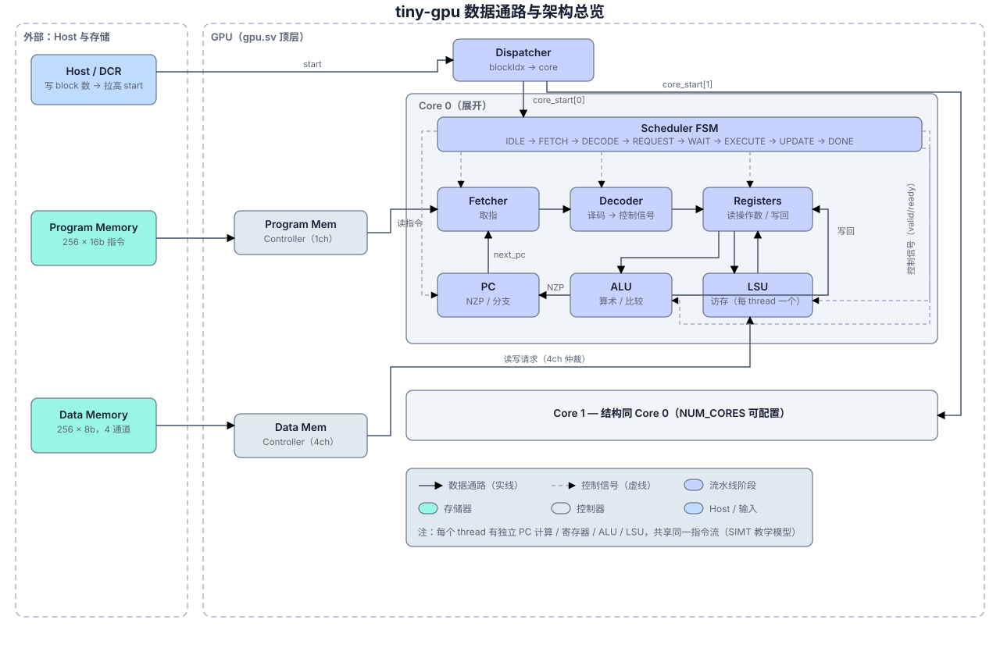

# tiny-gpu 深度学习笔记

## 目录

- [1. 项目概述与学习方法](#1-项目概述与学习方法)
- [2. 学习路线](#2-学习路线)
- [3. 模块掌握清单](#3-模块掌握清单)
- [4. 架构笔记](#4-架构笔记)
  - [4.1 整体微架构](#41-整体微架构)
  - [4.2 ISA 与指令语义](#42-isa-与指令语义)
  - [4.3 执行模型](#43-执行模型)
  - [4.4 内存模型](#44-内存模型)
  - [4.5 仿真验证](#45-仿真验证)
- [5. 分阶段自测问题](#5-分阶段自测问题)
- [6. 进阶扩展方向](#6-进阶扩展方向)

## 1. 项目概述与学习方法

`tiny-gpu` 是一个教学导向的迷你 GPU，用 SystemVerilog 描述硬件，用 cocotb 驱动仿真测试。README 将它定位为“从底层学习 GPU 工作方式”的极简实现，目标不是做完整图形 GPU，而是剥离现代 GPU 的大量复杂优化，只保留架构、并行执行和内存访问这三条主线。README 明确说该项目一次只执行一个 kernel，启动前需要加载 program memory、加载 data memory、写入线程数到 device control register，再拉高 `start` 信号（`README.md:66`、`README.md:68`-`README.md:73`）。

仓库的学习价值在于规模适中：`src/` 下 12 个 SystemVerilog 模块组成完整数据通路；`test/` 下有矩阵加法和矩阵乘法两个 kernel，既覆盖 SIMD 风格的线程索引计算，也覆盖 `LDR/STR` 的异步访存和 `CMP/BR` 的分支；`docs/images/` 给出 ISA、GPU、core、thread 和 trace 图；`README.md` 则提供了接近讲义级别的背景说明。源码和 README 的关系比较直接，但 README 中提到 cache 仍是 WIP，当前源码没有 cache 模块，学习时应以 `src/*.sv` 为准。

高效学习这个项目建议采用“从外到内，再从指令回到执行”的方法：

1. 先读 `README.md` 的 Architecture、ISA、Execution、Kernels 四节，建立心智模型。
2. 再读顶层 `gpu.sv`，确认参数、外部 memory 接口、DCR、dispatcher、controller、core 的连接关系。
3. 读 `dispatch.sv` 和 `scheduler.sv`，掌握 kernel 到 block、block 到 core、core 内状态机的层次。
4. 读 `fetcher.sv`、`decoder.sv`、`pc.sv`，把“指令如何进入控制信号，PC 何时更新”串起来。
5. 读 `registers.sv`、`alu.sv`、`lsu.sv`，理解每个 thread 的私有执行资源。
6. 最后读 `test/helpers/memory.py`、`test/helpers/format.py` 和两个测试，把二进制指令、汇编注释、memory handshake、结果断言对应起来。

学习时不要急于把它等同于生产级 GPU。这个项目的核心抽象是：一个 GPU 有多个 core；每个 core 一次执行一个 block；每个 block 最多含 `THREADS_PER_BLOCK` 个 thread；同一 core 内所有启用 thread 共享同一条指令流和同一个 `current_pc`，但每个 thread 有自己的寄存器、ALU、LSU 和 PC 计算单元。这是 SIMT/SIMD 教学模型，而不是完整的 warp scheduler、scoreboard、cache hierarchy 或 branch divergence 实现。

## 2. 学习路线

### 阶段一：入门与项目地图

前置知识：基本 Verilog/SystemVerilog 语法、组合/时序逻辑、`always @(posedge clk)`、非阻塞赋值、数组端口、参数化模块。

学习目标：知道项目为什么存在，能画出文件到功能的映射。先从 README 的 Overview 和 Architecture 开始：GPU 包含 DCR、dispatcher、可变数量 compute cores、data/program memory controllers，README 还提到 cache 但源码未实现（`README.md:75`-`README.md:82`）。再看 `gpu.sv` 的默认参数：数据地址 8 位、数据值 8 位、数据 memory 4 channel；程序地址 8 位、指令 16 位、程序 memory 1 channel；默认 2 个 core、每 block 4 个 thread（`src/gpu.sv:10`-`src/gpu.sv:18`）。

完成后应能回答：启动 kernel 需要哪些外部动作；为什么 data memory 和 program memory 分离；`NUM_CORES` 与 `THREADS_PER_BLOCK` 各自控制什么。

### 阶段二：流水线式控制流

前置知识：有限状态机、valid/ready 握手、同步状态转移。

核心文件：`scheduler.sv`、`fetcher.sv`、`decoder.sv`、`registers.sv`、`alu.sv`、`lsu.sv`、`pc.sv`。

学习目标：掌握 core 内“近似流水线阶段”的顺序。scheduler 定义 `IDLE/FETCH/DECODE/REQUEST/WAIT/EXECUTE/UPDATE/DONE` 七个状态（`src/scheduler.sv:40`-`src/scheduler.sv:47`）。它等待 fetcher 进入 `FETCHED` 后从 `FETCH` 到 `DECODE`（`src/scheduler.sv:63`-`src/scheduler.sv:67`），在 `WAIT` 阶段等待所有 LSU 不再处于 `REQUESTING/WAITING`（`src/scheduler.sv:77`-`src/scheduler.sv:90`），在 `UPDATE` 阶段遇到 `RET` 就宣告 block done，否则把 `current_pc` 更新成最后一个 thread 的 `next_pc`（`src/scheduler.sv:97`-`src/scheduler.sv:108`）。

完成后应能回答：为什么 `LDR/STR` 需要 WAIT；fetcher 的 `mem_read_valid` 什么时候拉高；寄存器为什么在 REQUEST 阶段读源操作数、在 UPDATE 阶段写回。

### 阶段三：ISA

前置知识：位段编码、opcode、寄存器寻址、立即数、条件分支。

核心文件：`decoder.sv`、`pc.sv`、`alu.sv`、`test/helpers/format.py`、两个测试程序。

学习目标：能手工解码测试里的 16 位指令。decoder 将 `instruction[15:12]` 作为 opcode，将 `instruction[11:8]`、`[7:4]`、`[3:0]` 作为 `rd/rs/rt`，同时把 `[7:0]` 作为 immediate，把 `[11:9]` 作为 branch 的 NZP 条件位（`src/decoder.sv:65`-`src/decoder.sv:70`）。`test/helpers/format.py` 用同样的切片规则把二进制指令格式化成汇编（`test/helpers/format.py:14`-`test/helpers/format.py:45`）。

完成后应能回答：`CONST R1,#8` 如何编码；`STR R7,R6` 在字段上为什么更像使用 `rs/rt` 而非 `rd`；`BRn` 的目标地址位于哪里。

### 阶段四：执行模型

前置知识：GPU block/thread 概念、SIMD/SIMT 基础、线程局部寄存器。

核心文件：`dispatch.sv`、`core.sv`、`registers.sv`、`scheduler.sv`。

学习目标：理解 thread 如何被映射到硬件资源。dispatcher 根据 `thread_count` 和 `THREADS_PER_BLOCK` 计算 `total_blocks`（`src/dispatch.sv:29`-`src/dispatch.sv:31`），把 block 分派给空闲 core，并为最后一个不满 block 计算实际 `core_thread_count`（`src/dispatch.sv:65`-`src/dispatch.sv:78`）。core 用 generate 为每个 thread 实例化 ALU、LSU、registers、PC（`src/core.sv:131`-`src/core.sv:210`）。每个 thread 的 `enable` 条件是 `i < thread_count`，因此最后一个 block 中多余 lane 会被关闭（`src/core.sv:139`、`src/core.sv:152`、`src/core.sv:178`、`src/core.sv:200`）。

完成后应能回答：`%blockIdx/%blockDim/%threadIdx` 从哪里来；为什么矩阵加法用 `blockIdx * blockDim + threadIdx` 得到全局线程索引；当前实现为什么不支持真正 branch divergence。

### 阶段五：仿真验证

前置知识：Python 基础、cocotb coroutine、时钟/reset、DUT 信号访问。

核心文件：`test/helpers/setup.py`、`test/helpers/memory.py`、`test/test_matadd.py`、`test/test_matmul.py`。

学习目标：会读测试如何加载程序、模拟外部 memory、检查结果。setup 创建 25 us 时钟，reset 一个周期，加载 program/data memory，写 DCR 中的线程数，再拉高 `start`（`test/helpers/setup.py:15`-`test/helpers/setup.py:37`）。`Memory.run()` 根据 DUT 的 `*_mem_read_valid` 和地址返回数据并拉高 ready；对 data memory 还处理 write valid、写入数组并拉高 write ready（`test/helpers/memory.py:24`-`test/helpers/memory.py:69`）。矩阵加法测试启动 8 个 thread，断言地址 16 起的 8 个结果等于 A+B（`test/test_matadd.py:35`-`test/test_matadd.py:66`）。矩阵乘法测试启动 4 个 thread，断言地址 8 起的 4 个结果为 2x2 矩阵乘法结果（`test/test_matmul.py:51`-`test/test_matmul.py:91`）。

当前环境尝试运行 `make test_matadd` 时失败，原因是缺少 `cocotb-config` 和 `iverilog`；因此本文未基于本机新仿真结果背书，只基于源码与测试代码分析。

**（2026-08-13 已更新）** 本机仿真环境现已搭建并验证通过：iverilog 13.0 + cocotb 1.9.2（micromamba env `tinygpu`）+ sv2v v0.0.13，`test_matadd` 与 `test_matmul` 均 PASS。运行方式见 4.5 节。

### 阶段六：进阶与扩展

前置知识：基础微架构优化、cache、流水线 hazard、GPU warp 概念。

学习目标：理解当前设计的边界。README 的 Advanced Functionality 点名了多级 cache/shared memory、memory coalescing、pipelining、warp scheduling、branch divergence、barrier 等现代 GPU 功能（`README.md:334`-`README.md:378`）。源码中这些功能大多没有实现，适合作为扩展练习。

## 3. 模块掌握清单

### `gpu.sv`

- 能解释顶层参数默认值：`NUM_CORES=2`、`THREADS_PER_BLOCK=4`、data memory 4 channel、program memory 1 channel（`src/gpu.sv:10`-`src/gpu.sv:18`）。
- 能画出 DCR、data controller、program controller、dispatcher、core array 的连接关系（`src/gpu.sv:75`-`src/gpu.sv:151`）。
- 能解释 `NUM_LSUS = NUM_CORES * THREADS_PER_BLOCK`，即每个 core 的每个 thread 有一个 LSU consumer（`src/gpu.sv:57`-`src/gpu.sv:66`）。
- 能说明 fetcher consumers 数量等于 core 数量（`src/gpu.sv:68`-`src/gpu.sv:73`）。
- 能解释 generate block 中为何需要把 per-core LSU 信号映射到扁平的 memory controller consumer 数组（`src/gpu.sv:153`-`src/gpu.sv:184`）。

### `dcr.sv`

- 能说明 DCR 当前只保存 `thread_count`，没有 grid/block 维度等复杂配置（`src/dcr.sv:4`-`src/dcr.sv:17`）。
- 能解释 reset 时 thread_count 清零，`device_control_write_enable` 有效时写入 `device_control_data`（`src/dcr.sv:19`-`src/dcr.sv:27`）。

### `dispatch.sv`

- 能解释 `total_blocks = ceil(thread_count / THREADS_PER_BLOCK)` 的实现（`src/dispatch.sv:29`-`src/dispatch.sv:31`）。
- 能说明 `blocks_dispatched` 和 `blocks_done` 分别追踪已派发和已完成 block（`src/dispatch.sv:33`-`src/dispatch.sv:36`）。
- 能解释 core reset 后如何领取新 block、设置 `core_block_id` 和 `core_thread_count`（`src/dispatch.sv:65`-`src/dispatch.sv:78`）。
- 能解释 core 完成后 dispatcher 如何 reset core 并增加 `blocks_done`（`src/dispatch.sv:82`-`src/dispatch.sv:88`）。
- 能指出 `done` 在所有 block 完成后拉高（`src/dispatch.sv:60`-`src/dispatch.sv:63`）。

### `controller.sv`

- 能说明 controller 是多 consumer 到有限 memory channel 的仲裁/转发器（`src/controller.sv:4`-`src/controller.sv:13`）。
- 能列出 channel 状态：`IDLE/READ_WAITING/WRITE_WAITING/READ_RELAYING/WRITE_RELAYING`（`src/controller.sv:38`-`src/controller.sv:42`）。
- 能解释 IDLE channel 如何扫描 consumer 的 read/write valid，并用 `channel_serving_consumer` 避免多个 channel 服务同一 consumer（`src/controller.sv:67`-`src/controller.sv:95`）。
- 能解释 read ready 后如何把数据 relay 回对应 consumer（`src/controller.sv:97`-`src/controller.sv:104`）。
- 能解释 relay 阶段为什么等待 consumer valid 下降后释放 channel（`src/controller.sv:114`-`src/controller.sv:127`）。

### `core.sv`

- 能说明每个 core 一次处理一个 block，包含一个 fetcher、一个 decoder、一个 scheduler，以及每 thread 一套 ALU/LSU/registers/PC（`src/core.sv:4`-`src/core.sv:13`、`src/core.sv:74`-`src/core.sv:210`）。
- 能追踪 `instruction`、`current_pc`、`rs/rt`、`alu_out`、`lsu_out`、decoded control signals 如何在子模块间流动（`src/core.sv:42`-`src/core.sv:72`）。
- 能解释 disabled lane 的 `enable(i < thread_count)` 机制（`src/core.sv:139`、`src/core.sv:152`、`src/core.sv:178`、`src/core.sv:200`）。

### `fetcher.sv`

- 能说明 fetcher 在 core `FETCH` 状态拉高 program memory read valid，并以 `current_pc` 为地址（`src/fetcher.sv:39`-`src/fetcher.sv:46`）。
- 能解释等待 `mem_read_ready` 后锁存 `mem_read_data` 到 `instruction`（`src/fetcher.sv:48`-`src/fetcher.sv:54`）。
- 能说明 core 进入 `DECODE` 后 fetcher 回到 IDLE（`src/fetcher.sv:56`-`src/fetcher.sv:60`）。

### `decoder.sv`

- 能背出 opcode：NOP `0000`、BRnzp `0001`、CMP `0010`、ADD `0011`、SUB `0100`、MUL `0101`、DIV `0110`、LDR `0111`、STR `1000`、CONST `1001`、RET `1111`（`src/decoder.sv:34`-`src/decoder.sv:44`）。
- 能解释字段切片：opcode `[15:12]`，rd `[11:8]`，rs `[7:4]`，rt `[3:0]`，imm `[7:0]`，nzp `[11:9]`（`src/decoder.sv:65`-`src/decoder.sv:70`）。
- 能说明各类指令设置哪些控制信号：算术写寄存器并选择 ALU，LDR 写寄存器并读内存，STR 只写内存，CMP 写 NZP，BR 选择 PC mux，RET 设置 `decoded_ret`（`src/decoder.sv:83`-`src/decoder.sv:130`）。

### `scheduler.sv`

- 能画出七状态控制流（`src/scheduler.sv:40`-`src/scheduler.sv:47`）。
- 能解释 FETCH 等待 fetcher 完成、WAIT 等待 LSU 完成、UPDATE 写 PC 或 done 的条件（`src/scheduler.sv:63`-`src/scheduler.sv:108`）。
- 能指出当前无 branch divergence：`current_pc` 直接取 `next_pc[THREADS_PER_BLOCK-1]`（`src/scheduler.sv:103`-`src/scheduler.sv:104`）。

### `registers.sv`

- 能说明每 thread 有 16 个 8-bit register，其中 R0-R12 可写，R13-R15 是 `%blockIdx/%blockDim/%threadIdx`（`src/registers.sv:44`-`src/registers.sv:69`）。
- 能解释 `%blockIdx` 每周期跟随 dispatcher 下发的 `block_id` 更新（`src/registers.sv:70`-`src/registers.sv:72`）。
- 能说明 REQUEST 阶段读 `rs/rt`，UPDATE 阶段按 mux 从 ALU/LSU/immediate 写回 `rd`（`src/registers.sv:74`-`src/registers.sv:99`）。
- 能指出特殊寄存器不可写，因为写回要求 `decoded_rd_address < 13`（`src/registers.sv:80`-`src/registers.sv:84`）。

### `alu.sv`

- 能说明 ADD/SUB/MUL/DIV 在 EXECUTE 阶段执行（`src/alu.sv:23`-`src/alu.sv:55`）。
- 能解释 CMP 复用 ALU，通过 `decoded_alu_output_mux` 输出 `{positive, zero, negative}` 到低 3 位，供 PC 的 NZP 使用（`src/alu.sv:35`-`src/alu.sv:40`）。
- 能注意 8-bit 数据宽度下算术溢出、除零等行为未额外处理，需自行验证。

### `lsu.sv`

- 能说明 LDR/STR 的 LSU 状态：IDLE、REQUESTING、WAITING、DONE（`src/lsu.sv:38`）。
- 能解释 LDR 用 `rs` 作为读地址，ready 后把 `mem_read_data` 放入 `lsu_out`（`src/lsu.sv:50`-`src/lsu.sv:78`）。
- 能解释 STR 用 `rs` 作为写地址，`rt` 作为写数据（`src/lsu.sv:80`-`src/lsu.sv:108`）。
- 能说明 DONE 状态要等 core 到 UPDATE 才回 IDLE（`src/lsu.sv:71`-`src/lsu.sv:75`、`src/lsu.sv:101`-`src/lsu.sv:105`）。

### `pc.sv`

- 能说明 PC 在 EXECUTE 阶段计算 `next_pc`，默认 `current_pc + 1`（`src/pc.sv:41`-`src/pc.sv:54`）。
- 能解释 BRnzp：若本地 NZP 寄存器与 decoded NZP 条件有交集，则跳转到 immediate，否则顺序执行（`src/pc.sv:43`-`src/pc.sv:50`）。
- 能说明 CMP 的结果在 UPDATE 阶段写入 NZP 寄存器（`src/pc.sv:57`-`src/pc.sv:64`）。

## 4. 架构笔记



*图 1：tiny-gpu 顶层架构与 Core 0 内部流水线。实线为数据通路，虚线为 Scheduler 控制信号。*

### 4.1 整体微架构

顶层路径可以概括为：

```text
host/testbench
  -> DCR(thread_count) + start
  -> dispatch(block 分派)
  -> core(scheduler 控制)
  -> fetcher/program controller/program memory
  -> decoder(control signals)
  -> per-thread registers/ALU/LSU/PC
  -> data controller/data memory
  -> dispatch done -> gpu done
```

`gpu.sv` 是连接中心。DCR 输出 `thread_count` 给 dispatcher（`src/gpu.sv:75`-`src/gpu.sv:83`、`src/gpu.sv:136`-`src/gpu.sv:151`）。dispatcher 负责将总线程数切成 blocks，并把 block_id、block 内 thread_count、start/reset 下发给 core（`src/dispatch.sv:65`-`src/dispatch.sv:88`）。每个 core 的 fetcher 通过 program memory controller 读 16-bit 指令；每个 thread 的 LSU 通过 data memory controller 读写 8-bit 数据（`src/gpu.sv:85`-`src/gpu.sv:134`）。

core 内部的数据通路是“共享控制、私有数据”。fetcher 和 decoder 在 core 级别只有一份，因此一个 core 的所有 thread 同步执行同一条指令（`src/core.sv:74`-`src/core.sv:111`）。ALU、LSU、registers、PC 则按 thread generate 出多份（`src/core.sv:131`-`src/core.sv:210`），所以同一条 ADD 或 LDR 可以对不同 thread 的不同寄存器值并行执行。这正是项目用来展示 SIMD/SIMT 的关键。

scheduler 将每条指令拆成多个阶段。FETCH 阶段由 fetcher 发起程序 memory read；DECODE 阶段由 decoder 产生控制信号；REQUEST 阶段 register file 读出 `rs/rt`，LSU 若需要访存则进入 request；WAIT 阶段等待所有 LSU 完成；EXECUTE 阶段 ALU 和 PC 计算；UPDATE 阶段写回寄存器、写 NZP、更新 `current_pc` 或结束 block。README 也用同样顺序描述 core 控制流（`README.md:203`-`README.md:210`）。

### 4.2 ISA 与指令语义

指令宽度固定 16 bit。实际源码中的字段解释如下：

| 字段 | 位段 | 用途 |
|---|---:|---|
| opcode | `[15:12]` | 指令类型 |
| rd | `[11:8]` | 目的寄存器，算术/LDR/CONST 使用 |
| rs | `[7:4]` | 源寄存器 1；LDR/STR 中作为地址寄存器 |
| rt | `[3:0]` | 源寄存器 2；STR 中作为数据寄存器 |
| imm | `[7:0]` | CONST 立即数或 BR 目标 PC |
| nzp | `[11:9]` | BR 条件位，和 PC 内保存的 NZP 比较 |

这些切片由 decoder 直接给出（`src/decoder.sv:65`-`src/decoder.sv:70`）。`format.py` 的 trace formatter 也按 opcode、rd、rs、rt、imm 打印指令（`test/helpers/format.py:14`-`test/helpers/format.py:45`）。注意 `format.py` 中 `n/z/p` 判断写成了 `instruction[4] == 1` 这类字符串与整数比较，格式化 BR 条件名可能需要自行验证，但不影响硬件 decoder 逻辑。

指令语义：

- `NOP` (`0000`)：不设置控制信号。
- `BRnzp` (`0001`)：设置 `decoded_pc_mux`，PC 在 EXECUTE 阶段检查 `(nzp & decoded_nzp) != 0`，满足则跳转到 `imm`（`src/decoder.sv:88`-`src/decoder.sv:90`、`src/pc.sv:43`-`src/pc.sv:50`）。
- `CMP` (`0010`)：ALU 输出比较结果，PC 在 UPDATE 阶段写 NZP（`src/decoder.sv:91`-`src/decoder.sv:94`、`src/alu.sv:37`-`src/alu.sv:40`、`src/pc.sv:57`-`src/pc.sv:64`）。
- `ADD/SUB/MUL/DIV` (`0011/0100/0101/0110`)：选择 ALU 算术 mux，写回 `rd`（`src/decoder.sv:95`-`src/decoder.sv:114`、`src/alu.sv:42`-`src/alu.sv:55`）。
- `LDR` (`0111`)：读内存，使能寄存器写回，写回来源选择 LSU，LSU 用 `rs` 作地址，返回数据写入 `rd`（`src/decoder.sv:115`-`src/decoder.sv:119`、`src/lsu.sv:50`-`src/lsu.sv:78`）。
- `STR` (`1000`)：写内存，LSU 用 `rs` 作地址、`rt` 作数据，不写寄存器（`src/decoder.sv:120`-`src/decoder.sv:122`、`src/lsu.sv:80`-`src/lsu.sv:108`）。
- `CONST` (`1001`)：把 8-bit immediate 写入 `rd`（`src/decoder.sv:123`-`src/decoder.sv:126`、`src/registers.sv:93`-`src/registers.sv:96`）。
- `RET` (`1111`)：设置 `decoded_ret`，scheduler 在 UPDATE 阶段将 core 置 done（`src/decoder.sv:127`-`src/decoder.sv:129`、`src/scheduler.sv:97`-`src/scheduler.sv:101`）。

寄存器编号为 4 bit，共 16 个。R0-R12 是普通可写寄存器，R13/R14/R15 分别是 `%blockIdx/%blockDim/%threadIdx`。reset 时 `%blockDim` 初始化为 `THREADS_PER_BLOCK`，`%threadIdx` 初始化为 generate 的 thread id，`%blockIdx` 初始为 0，运行时随 dispatcher 下发的 block_id 更新（`src/registers.sv:66`-`src/registers.sv:72`）。

### 4.3 执行模型

`tiny-gpu` 的核心执行模型是 block 级分派、thread lane 级并行。默认 `THREADS_PER_BLOCK=4`，所以每个 core 有 4 条 thread lane。矩阵加法测试启动 8 个 thread，因此 dispatcher 会形成 2 个 block；默认 `NUM_CORES=2` 时理论上可同时让两个 core 分别处理一个 block（`src/gpu.sv:17`-`src/gpu.sv:18`、`test/test_matadd.py:35`-`test/test_matadd.py:45`）。

每个 thread 通过特殊寄存器获得自己的全局索引：`i = blockIdx * blockDim + threadIdx`。矩阵加法和乘法测试都以 `MUL R0, %blockIdx, %blockDim` 加 `ADD R0, R0, %threadIdx` 开头（`test/test_matadd.py:13`-`test/test_matadd.py:14`、`test/test_matmul.py:13`-`test/test_matmul.py:14`）。这就是相同程序在不同 thread 上处理不同数据的关键。

当前实现有 SIMT 风格，但没有真正的 warp scheduling 或 divergence 管理。每个 core 共享一个 `current_pc`，虽然每个 thread 都有 PC 模块计算 `next_pc`，scheduler 最后只取 `next_pc[THREADS_PER_BLOCK-1]` 更新 core 级 `current_pc`（`src/scheduler.sv:103`-`src/scheduler.sv:104`）。因此 README 中“假设所有线程每条指令后收敛到同一 PC”的说法非常关键（`README.md:177`-`README.md:179`）。矩阵乘法虽然用了 `CMP/BRn` 循环，但所有 thread 的循环次数相同，所以满足这个限制（`README.md:262`-`README.md:306`、`test/test_matmul.py:37`-`test/test_matmul.py:38`）。

### 4.4 内存模型

项目把 program memory 和 data memory 分离。README 给出的规格是：data memory 8-bit addressability，即 256 行，每行 8-bit；program memory 8-bit addressability，即 256 行，每条 16-bit 指令（`README.md:101`-`README.md:111`）。源码默认参数与此一致（`src/gpu.sv:11`-`src/gpu.sv:16`）。

program memory 是只读接口，默认只有 1 个 channel；data memory 有读写接口，默认 4 个 channel（`src/gpu.sv:31`-`src/gpu.sv:45`）。controller 的职责是把多个 consumer 的请求节流到有限 channel 上。对于 data memory，consumer 是所有 LSU，总数为 `NUM_CORES * THREADS_PER_BLOCK`；对于 program memory，consumer 是所有 fetcher，总数等于 `NUM_CORES`（`src/gpu.sv:57`-`src/gpu.sv:73`）。

LSU 的协议很直接：LDR 时，REQUEST 阶段后把 `mem_read_valid` 拉高、地址为 `rs`，等 `mem_read_ready` 后取 `mem_read_data` 到 `lsu_out`；STR 时，把 `mem_write_valid` 拉高、地址为 `rs`、数据为 `rt`，等 `mem_write_ready` 后完成（`src/lsu.sv:50`-`src/lsu.sv:108`）。测试的 `Memory.run()` 是一个零延迟/单步响应风格的外部 memory 模型：看到 valid 就立即根据地址读数组并 ready；看到 write valid 就立即写数组并 ready（`test/helpers/memory.py:24`-`test/helpers/memory.py:69`）。因此它验证了握手和数据路径，但不模拟真实 DRAM 延迟、bank conflict 或 cache。

### 4.5 仿真验证

`Makefile` 的测试流程是：先 `make compile`，用 `sv2v` 把 SystemVerilog 转成 Verilog，再用 `iverilog` 构建 `build/sim.vvp`，最后通过 cocotb VPI 运行 `MODULE=test.test_$*`（`Makefile:5`-`Makefile:8`）。compile 过程先单独转换 `alu.sv`，再转换全部 `src/*` 到 `build/gpu.v`，并追加 `alu.v`（`Makefile:10`-`Makefile:20`）。

矩阵加法测试的 program memory 是 13 条指令，从计算全局 index 开始，加载 A/B 基址，读取 A[i] 和 B[i]，相加后写到 C[i]，最后 RET（`test/test_matadd.py:12`-`test/test_matadd.py:25`）。data memory 初始地址 0-7 是 A，8-15 是 B，结果检查 16-23（`test/test_matadd.py:28`-`test/test_matadd.py:66`）。

矩阵乘法测试的 program memory 是 29 条指令，实现 2x2 矩阵乘法。它先计算 `row=i//N`、`col=i%N`，初始化 `acc` 和 `k`，循环加载 A[row,k] 与 B[k,col]，累加乘积，`CMP R9,R2` 后 `BRn LOOP`，最后写 C[i]（`test/test_matmul.py:13`-`test/test_matmul.py:41`）。结果地址从 8 开始（`test/test_matmul.py:80`-`test/test_matmul.py:91`）。

**本机运行环境（已验证，2026-08-13）**

工具链全部装在用户目录，无 sudo 依赖：

- iverilog 13.0 + cocotb 1.9.2 + pytest → micromamba env `tinygpu`（micromamba 位于 `~/tools/bin/`）
- sv2v v0.0.13 → `~/.local/bin/sv2v`（源仓库为 `zachjs/sv2v`，原 `chipsalliance/sv2v` 已失效）
- ⚠️ cocotb 必须用 1.9.x：Makefile 依赖 `cocotb-config --prefix` 与 `libcocotbvpi_icarus`，cocotb 2.0 已移除这些接口
- ⚠️ iverilog 13 无法直接编译 `src/*.sv`（unpacked array port 等语法不支持），必须走 sv2v → iverilog 链路

跑测试的命令：

```bash
export PATH=$HOME/.local/bin:$PATH
~/tools/bin/micromamba run -n tinygpu make test_matadd   # PASS（4.5M 仿真时钟）
~/tools/bin/micromamba run -n tinygpu make test_matmul   # PASS（12.3M 仿真时钟）
```

## 5. 分阶段自测问题

### 阶段一：入门

1. tiny-gpu 为什么把 program memory 和 data memory 分开？
2. 默认配置下 GPU 有几个 core？每个 block 有几个 thread lane？
3. 启动一个 kernel 前，testbench 必须完成哪几件事？
4. README 提到 cache，但源码中是否真的存在 cache 模块？
5. `device_control_data` 当前表示什么？如果未来支持二维 grid，DCR 可能要扩展哪些字段？
6. `gds/` 目录与学习微架构有什么关系？什么时候需要关注它？

### 阶段二：流水线/状态机

1. scheduler 的七个状态分别做什么？
2. fetcher 为什么需要自己的 `FETCHING/FETCHED` 状态，而不是 scheduler 直接读 memory？
3. register file 为什么在 REQUEST 阶段读 `rs/rt`，在 UPDATE 阶段写 `rd`？
4. `LDR` 指令下，core 为什么必须经过 WAIT？
5. `ADD` 指令没有访存，为什么仍然会经过 REQUEST 和 WAIT？
6. `RET` 在哪个阶段真正让 core done？
7. 如果 external memory 延迟增加，哪些状态会停留更久？

### 阶段三：ISA

1. 手工解码 `0b0101000011011110`：opcode、rd、rs、rt 分别是什么？
2. `CONST R3,#16` 的 opcode、rd、imm 应该如何编码？
3. 为什么 `BRn LOOP` 的条件位来自 `[11:9]`，目标地址来自 `[7:0]`？
4. `CMP R9,R2` 本身会不会写普通寄存器？
5. `LDR R4,R4` 的第一个 R4 和第二个 R4 分别是什么语义？
6. `STR R7,R6` 为什么不需要 `rd`？
7. R13-R15 为什么不能作为写回目的寄存器？
8. 8-bit 数据路径下，`MUL` 溢出时当前设计如何处理？需自行验证。

### 阶段四：执行模型

1. `thread_count=8`、`THREADS_PER_BLOCK=4` 时有几个 block？
2. 最后一个 block 不满时，哪些硬件 lane 会被关闭？
3. `%blockIdx/%blockDim/%threadIdx` 分别来自哪个模块或参数？
4. 为什么矩阵加法中每个 thread 会访问不同的 A[i]/B[i]？
5. 当前实现中，一个 core 内多个 thread 是否能执行不同 PC？为什么？
6. 矩阵乘法的分支为什么能在当前无 divergence 设计下工作？
7. 如果 thread0 分支而 thread1 不分支，当前 scheduler 会发生什么语义问题？

### 阶段五：仿真验证

1. `setup.py` 中 reset、加载 memory、写 DCR、拉高 start 的顺序是什么？
2. `Memory.run()` 如何把 DUT 的 valid/address 转换成 ready/data？
3. data memory 的 read channel 和 write channel 是如何在 Python helper 中模拟的？
4. `format_cycle()` 打印了哪些内部状态？这些状态分别来自哪些 DUT 层级？
5. 矩阵加法为什么检查地址 16-23？
6. 矩阵乘法为什么检查地址 8-11？
7. 为什么必须先用 sv2v 把 SystemVerilog 转换成 Verilog 才能用 iverilog 编译？直接 `iverilog src/*.sv` 会报什么错？
8. 如果要增加一个新 kernel 测试，需要修改哪些部分？

### 阶段六：进阶扩展

1. 如果要实现 instruction cache，应插在 fetcher 和 program memory controller 之间，还是 controller 和 external memory 之间？各有什么取舍？
2. data memory controller 现在是简单扫描 consumer；如何改成 round-robin 或带优先级仲裁？
3. memory coalescing 需要观察哪些 LSU 请求字段？
4. pipeline 化后，哪些阶段之间需要 hazard 检测？
5. branch divergence 需要把 `current_pc` 从 core 级改成什么结构？
6. shared memory 应该是 core 私有、block 私有还是全局共享？为什么？
7. barrier 指令需要 scheduler 增加哪些状态或计数？

## 6. 进阶扩展方向

最自然的扩展顺序是先做验证增强，再做架构增强。

第一步建议写一个小 assembler，把 README 中的汇编转换成 16-bit 指令，减少手写二进制带来的错误。测试中已经存在 `format_instruction()` 的反向格式化逻辑，可作为字段定义参考（`test/helpers/format.py:14`-`test/helpers/format.py:45`）。

第二步建议补单元测试。当前测试是端到端 kernel 测试，覆盖真实执行路径，但定位错误成本较高。可以分别给 decoder、ALU、PC、LSU、controller 写小测试：例如 decoder 输入每个 opcode，断言控制信号；PC 输入不同 NZP 和 branch 条件，断言 next_pc；controller 输入多个 consumer valid，断言 channel 选择和 relay 行为。

第三步可优化 memory controller。当前 controller 顺序扫描 consumer，读优先于写，且通过 valid 下降释放 channel（`src/controller.sv:70`-`src/controller.sv:127`）。可以研究公平性、饥饿问题、同时 read/write 的优先级，以及多 channel 下的仲裁策略。

第四步可做真正的 divergence。现在 scheduler 只保存一个 core 级 `current_pc`，并用最后一个 lane 的 `next_pc` 作为下一条指令地址（`src/scheduler.sv:103`-`src/scheduler.sv:104`）。要支持 divergence，至少需要 per-thread PC、active mask、分支栈或 reconvergence 机制；fetch/decode 也要从“一个 core 一条指令”扩展为按 active mask 执行。

第五步可做更接近 GPU 的 warp scheduling。当前一个 block 在一个 core 上同步执行到 completion，遇到 memory wait 整个 core 停住。warp scheduling 可以把 block 拆成多个 warp，当一个 warp 等 LSU 时切换到另一个 warp，从而隐藏内存延迟。这会引入多组 register/PC/active mask 或更复杂的上下文保存。

最后再考虑 cache、shared memory、barrier 和 pipeline。这些优化都需要更强的验证基础，否则很容易在教学项目中把简单性丢掉。建议每次只引入一个机制，并用 README 的两个 kernel 加一两个针对性 kernel 保证行为没有回归。
